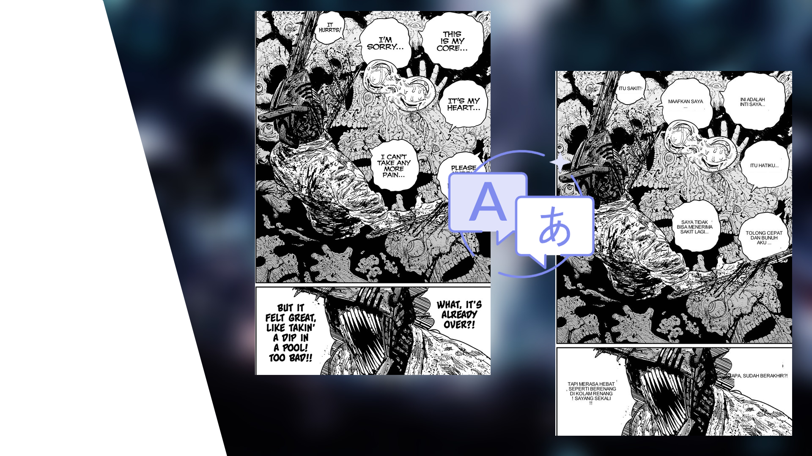
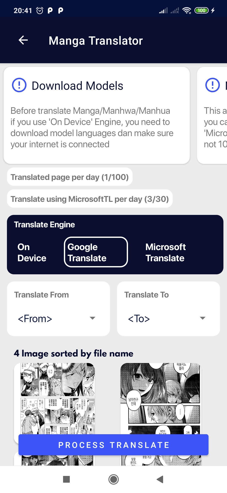
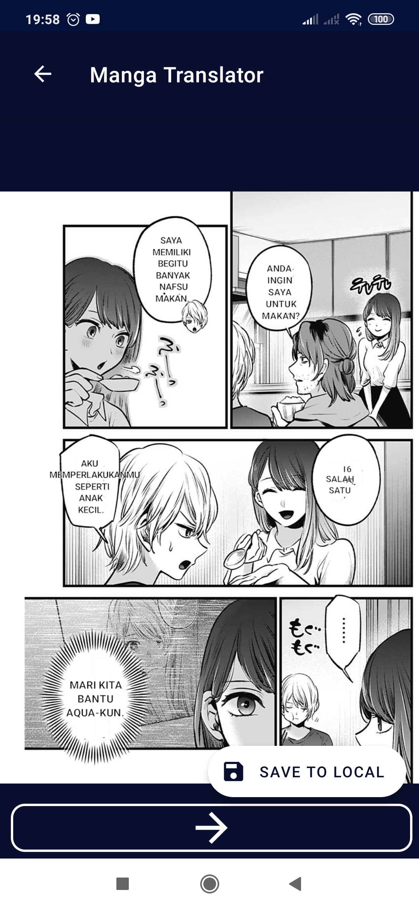

# **Manga-Translator**

Get it on [PlayStore](https://play.google.com/store/apps/details?id=com.wiryaimd.mangatranslator)

Fast translation up to 60+ languages. This app will atuomatically detect text in image, auto translate text and draw text automatically

#

These are some main part from MangaTranslator to work translating your fu.. cuties comics
### **Vision Image:**
To detecting text and will ignoring text who use shitty font
- Detecting text in image using [MLKit TextRecognition v2](https://developers.google.com/ml-kit/vision/text-recognition/v2/android)

### **Translator text:**
Yes, just for translating text and return weird result from original text
- Translate text using MLKit Translate [here](https://developers.google.com/ml-kit/language/translation/android)
- Second translate text using Microsoft Translate from [RapidAPI](https://rapidapi.com/microsoft-azure-org-microsoft-cognitive-services/api/microsoft-translator-text/)
- Supported languages for this translation [here](https://developers.google.com/ml-kit/language/translation/translation-language-support)

### **Drawer Image:**
Will draw and paste translated text to your requested image
- Using Canvas from Android SDK
- Some confused function from my code

#

### Preview Image

#
Lets start to contributes in my shitty project, maybe a ton of bugs and more features can be solved with this